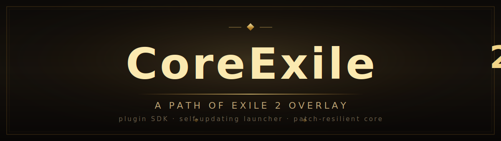
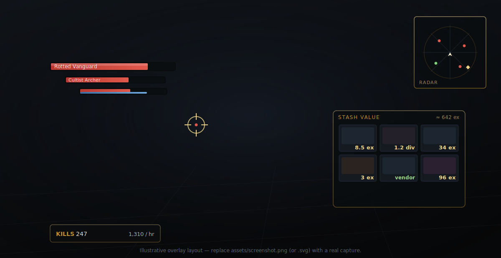

  

# CoreExile2

**A Path of Exile 2 overlay that does the boring parts for you.**

Map smarter, loot faster, and never alt-tab to a price site again. CoreExile2 reads the running game, draws an ImGui overlay on top, and loads 17 feature plugins at runtime — and one self-updating launcher keeps the whole thing current.

  <!-- Illustrative placeholder. Drop a real overlay capture at assets/screenshot.png and point this  there. -->
  

↑ Illustrative layout — replace <code>assets/screenshot.svg</code> with a live overlay capture.

---

## Why CoreExile2

A fork of the **GameHelper2** engine, tuned for Path of Exile 2 and built to survive patches.

- 🔄 **Self-updating launcher** — `Launcher.exe` updates the overlay *and* individual plugins in place from GitHub releases. Patch drops, you relaunch, you're current.
- 🔌 **ExileBridge SDK** — a pure-interface plugin API. Plugins reference only `ExileBridge.dll` and never touch game memory directly; the host implements everything behind clean interfaces.
- 🛡️ **Patch-resilient core** — every memory offset lives in one `GameOffsets` project, and reads are hardened against the torn reads that come with scanning a live process. When PoE2 patches, there's one place to fix.
- ⚡ **Modern stack** — .NET 10, Windows x64, ImGui rendering.

---

## What you can actually do

Jump to the part you came for. Every plugin below ships today.

### 🗺️ Mapping & navigation

| Plugin | What it does |
| --- | --- |
| **Radar** | Walkability terrain map with live entity dots and configurable item/monster highlighting — see the layout before you walk it. |
| **Atlas** | Endgame Atlas overlay with map pathfinding, so planning a run isn't a spreadsheet. |
| **FollowBot** | Sticks to your party leader through the whole map, hands-free. |

### 💰 Loot & economy

| Plugin | What it does |
| --- | --- |
| **StashValue** | Prices *every* item in an open stash or inventory, right on each slot — resolving each item's **real localized name** from the game's `BaseItemTypes` table and pricing it from **poe.ninja + poe2scout** (merged), with the league and exchange rates auto-resolved. |
| **RunecraftHelper** | Instantly prices Expedition / runecraft rewards so you pick the right one — language-independent via `BaseItemTypes`. |
| **MapKillCounter** | Live kill count and **kills/hour** for the current map — know if your farm is actually fast. |

### ⚔️ Combat & automation

| Plugin | What it does |
| --- | --- |
| **AutoAim** | Aims your skills at the best nearby target, with optional **filter-based auto-pickup**. |
| **AutoPot** | Fires life / mana flasks automatically at the thresholds you set. |
| **AutoHotKeyTrigger** | Rule-based automation — trigger keys when conditions hit. |
| **CustomHotkeys** | Your own hotkey macros and key remaps. |
| **MapClearBot** | Full automated clearing: A\* pathfinding, reachability-based exploration, combat, loot, and stuck/flee recovery. |

### 🩸 On-screen info & league content

| Plugin | What it does |
| --- | --- |
| **HealthBars** | Clean life / energy-shield bars over monsters and allies. |
| **SekhemaHelper** | A focused helper overlay for the Trial of the Sekhemas. |

### 🛠️ For developers

| Plugin | What it does |
| --- | --- |
| **DebugOverlay** | UI-element and memory inspector for poking at game state. |
| **WorldDrawing** | World-space drawing utilities for prototyping visual features. |
| **ExileBridgeSample** · **SamplePluginTemplate** | Copy-paste starting points for your own plugin. |

> 🚧 **In development:** **TradeHelper** is experimental and not yet a shipping plugin.

---

## 🚀 Quick start

1. **Grab a release.** Download the latest build from the [Releases](https://github.com/coussiraty/CoreExile2/releases) page.
2. **Run the launcher.** Start `Launcher.exe` — it pulls down (and keeps updating) the overlay and your plugins from GitHub.
3. **Launch Path of Exile 2**, then open the overlay and toggle on the plugins you want.

Prefer to build it yourself? Full instructions, the runtime layout, and troubleshooting live in **[BUILD.md](BUILD.md)**.

---

## ✍️ Write your own plugin

The whole point of **ExileBridge** is that you never have to learn the memory layer.

- Reference **`ExileBridge.dll`** and nothing else — the host wires up entities, components, and services behind clean interfaces.
- **[PLUGIN_GUIDE.md](PLUGIN_GUIDE.md)** walks you through the SDK services, entity components, helpers, and worked examples.
- Start from **`ExileBridgeSample`** or **`SamplePluginTemplate`** and build out from there.

---

## 📚 Docs

| | |
| --- | --- |
| 🏗️ **[BUILD.md](BUILD.md)** | Build from source in Visual Studio, runtime layout, and troubleshooting. |
| 🧩 **[PLUGIN_GUIDE.md](PLUGIN_GUIDE.md)** | Write your own plugin — SDK services, entity components, helpers, worked examples. |

---

## ⚠️ Disclaimer

CoreExile2 reads game memory and draws an overlay on top of the game. Tools that do this **can violate a game's Terms of Service**. Use at your own risk.

---

## 🙏 Credits

CoreExile2 stands on a lot of other people's work.

- Built on the open-source **GameHelper / GameOffsets** engine.
- Item pricing data from **[poe.ninja](https://poe.ninja)** + **[poe2scout](https://poe2scout.com)**.

Several bundled plugins are **adaptations of other people's work**, ported to ExileBridge with full credit to the original authors — only the SDK wiring was changed:

| Plugin | Original author |
| --- | --- |
| **StashValue** | [zx0CF1/StashValue](https://github.com/zx0CF1/StashValue) |
| **MapKillCounter** | [MordWraith/MapKillCounter](https://github.com/MordWraith/MapKillCounter) |
| **RunecraftHelper** | [yokkenUA/RunecraftHelper](https://github.com/yokkenUA/RunecraftHelper) |
| **SekhemaHelper** | [yokkenUA/SekhemaHelper](https://github.com/yokkenUA/SekhemaHelper) |

If you're one of these authors and would like different credit, additional attribution, or removal, please [open an issue](https://github.com/coussiraty/CoreExile2/issues).

---

**[⬆ back to top](#coreexile2)** · Built for the PoE2 community.

